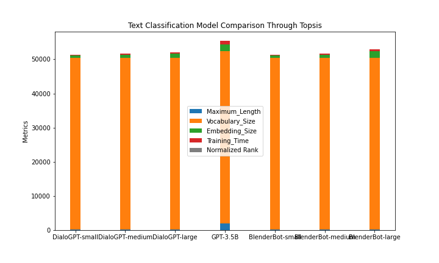

# Text Conversational Model Comparison Project (using TOPSIS)

## Overview
Text conversational models aim to generate human-like responses in natural language conversations. This project compares various pretrained models for text conversational tasks using the **TOPSIS** (Technique for Order of Preference by Similarity to Ideal Solution) method.

## Key Features
- **Metrics Considered:**
  - The comparison is based on essential metrics, including Maximum Length, Vocabulary Size, Embedding Size, and Training Time.

## Methodology - TOPSIS
- TOPSIS is employed for the comparison, considering both the similarity to the ideal solution and the dissimilarity to the negative ideal solution, providing a comprehensive ranking.

## Models Evaluated
- The comparison includes pretrained models specifically designed for text conversational tasks, such as:
  - DialoGPT-small
  - DialoGPT-medium
  - DialoGPT-large
  - GPT-3.5B
  - BlenderBot-small
  - BlenderBot-medium
  - BlenderBot-large

## Project Structure
- **data.csv**: CSV file containing evaluation metrics for each model.
- **result.csv**: CSV file with ranked results in tabular format and data used for creating a bar chart.
- **BarChart.png**: Bar chart visualizing the model comparison.

## How to Run
### Results and Analysis:

#### Ranked Table:
Explore detailed ranked results in **classification_table_result.csv**:

| Model              | Maximum Length | Vocabulary Size | Embedding Size | Training Time (hours) 
|--------------------|----------------|-----------------|----------------|-----------------------
| DialoGPT-small     | 128            | 50257           | 768            | 100                   
| DialoGPT-medium    | 128            | 50257           | 1024           | 200                   
| DialoGPT-large     | 128            | 50257           | 1280           | 300                   
| GPT-3.5B           | 2048           | 50257           | 2048           | 1000                 
| BlenderBot-small   | 128            | 50257           | 768            | 150                
| BlenderBot-medium  | 128            | 50257           | 1024           | 300                   
| BlenderBot-large   | 128            | 50257           | 2048           | 500                   

#### Bar Chart:
The bar chart visually represents the performance metrics of each model, providing an easy-to-understand comparison. Maximum Length, Vocabulary Size, Embedding Size, Training Time, and normalized ranks are included for comprehensive evaluation.

## Analysis
### Model Performance:
- **DialoGPT-large**: Demonstrates the highest maximum length and embedding size among DialoGPT models.
- **GPT-3.5B**: Stands out with the highest maximum length and embedding size overall.
- **BlenderBot-large**: Shows competitive performance with a moderate training time compared to larger models.

## Next Steps
Feel free to analyze the provided CSV files for more insights. Consider adjusting the evaluation metrics or adding new models based on your specific use case. Use the project as a foundation for ongoing research and development in text conversational modeling.
